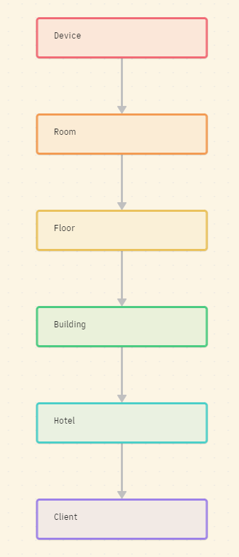
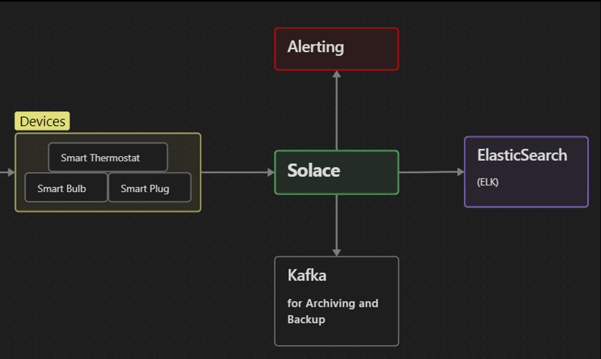

# Overview
This is a demo of solace. It simulates Smart Hotel. 
There are 3 sample hotels, 2 of which has only one floor, one of them has 2 floors.
Each floor will have a random number of rooms, and each room has 3 types of IoT devices: Thermostat, Light, and a Smart Plug. 
There is only one Thermostat and Smart Plug in each room, but a room can have up to 6 lights.
Room assignments are randomly generated every time you run the application.

# What is this doing?

The system simulates reading from different IoT sensors/devices: Smart Plug, Light, and Thermostat.
It will publishes those readings to 3 related topics in Solace.
There are several subscribers:
- Queue Consumer: which will consume events and indexes them in Elastic Search
- Topic Consumer: which also consumes events but from one topic and indexes it in Elastic Search
- Another Queue Consumer which reads all IoT events from backup queue and archives them in Kafka
- An Alerting system will listen to all the Thermostat events and if temperature is above 90, sends an Alert 

# Technical stuff

All of the code is written in C#. 
For the ease of wiring I've used Aspire which you can just run one project and it will run all the required projects and gives you a good UI to see all the logs on the web.

What you need:
- .NET framework with Aspire installed
- A Solace broker, code is using Cloud 
- ELK stack, I've used the docker version locally
- Kafka, I used docker version provided by Confluent which gives you a good web UI
